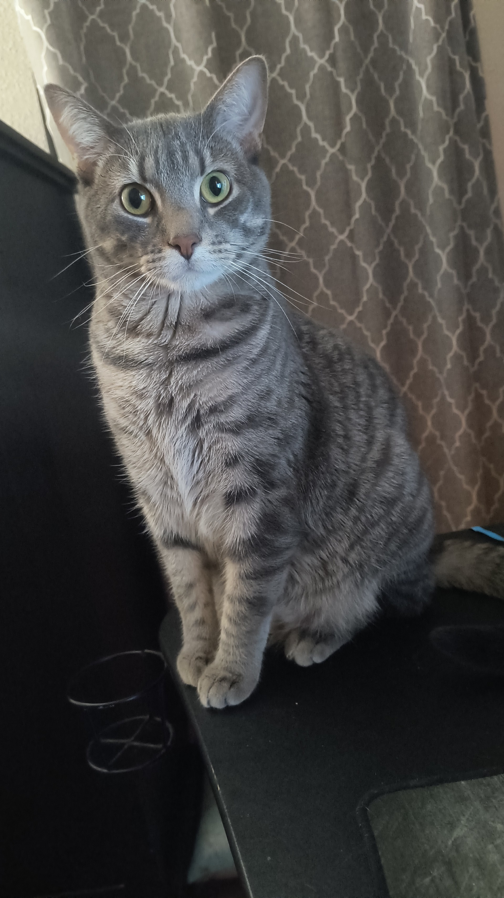

# Blake Evans

### Hi! I like hiking, primitive camping, and working on computers. I have messed with HTML, and CSS mostly to mess around with websites. I have a demanding cat, that does not like me sitting at my desk. As you can see with this picture during class... ###

Goals for course:
- To better understand the programs.
- To get a good grip on the entire process.
- A good starting point to get my foot in the door somewhere to start growing.

## I Found this article below interesting. (But I like code) ##

[Python Wasn't Built in a Day: An Origin Story Worth Knowing](https://ospo.gwu.edu/python-wasnt-built-day-origin-story-worth-knowing)

I am not sure completely, the thought of working in a team and getting to collaborate together is my type of place. The only good days at my current job (for now), are when problems come up, and nobody knows what to do, then we start coming together to find a solution and ways to make it better.

Quality control is nice sometimes because I get to find the issues and figure out a fix, then log everything.
