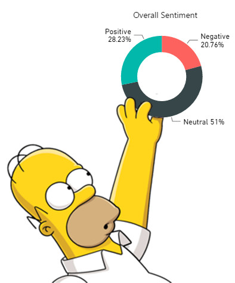

# Blake Evans

## My name is above and I like hiking, primitive camping, and working on computers.

Goals for course:
- To better understand the programs.
- To get a good grip on the entire process.
- A good starting point to get my foot in the door somewhere to start growing.

[Python Wasn't Built in a Day: An Origin Story Worth Knowing](https://ospo.gwu.edu/python-wasnt-built-day-origin-story-worth-knowing)

I enjoy coming together and solving problems and searching for answers, like with data, as a team and or if I am alone. 

---

